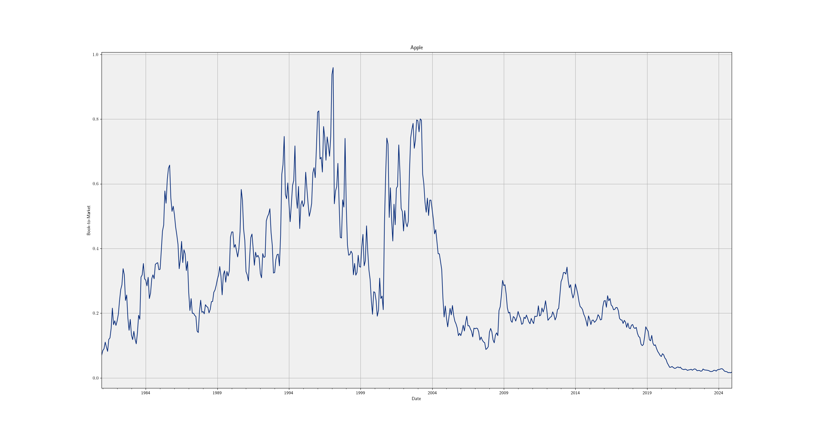
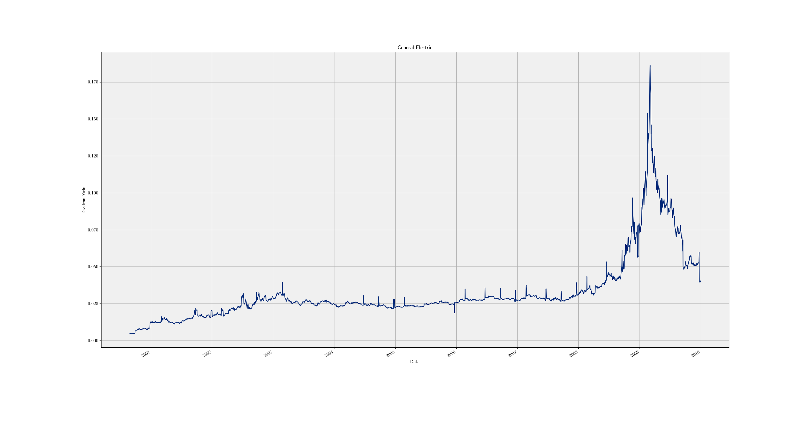

# FinToolsAP

Author: Andrew Maurice Perry

Email: Andrewpe@berkeley.edu

Start Date: 2023-06-20

### Overall Module Description:

`FinToolsAP` is a comprehensive Python package designed for researchers and data analysts in economics and finance. 
It provides streamlined tools for managing, processing, and querying large datasets using a local SQLite database, 
as well as convenient data manipulation utilities compatible with both pandas and polars.

### Modules 
- `LocalDatabase`
- `UtilityFunctions`
- `WebData`
- `Decorators`
- `FactorModels`

-----------------------------------------------------------------------------------

## Installation

FinToolsAP is downloaded using pip. The project is stored on PyPi.org. 

```bash
pip install FinToolsAP
```

## LocalDatabase

### Database Overview

The LocalDatabase module is a Python wrapper over a SQLite database. Because the backend of the Database
is SQL, much more targeted querying and big data operations are possible compared to storing data as
a `csv` or parquet file, but still allows for easy querying via Python. Additionally, sharing large 
databases is tantamount to sharing a couple of Python files. 

The database file structure is organized as follows:

- Database.db
- DatabaseContents.py
- ExtraScripts
- FILEStoDB
- CreateTables

#### Database.db

This is the SQLite database that stores the data.

#### DatabaseContents.py

This file lists all of the tables, variables, and data types in the Database. This file is core to the Database, and without it or if it is improperly specified, the operation of the Database will be severely affected. 

The file is organized as several Python classes that contain several member variables. There are two types of 
classes: (1) `Tables` and (2) user-specified classes. **The `Tables` class must be present in the `DatabaseContents.py` 
file for the Database to be operational.** It lists what files to run and download to construct the Database. 
It is structured as

```python
class Tables:

    # The order indicates the order in which data is added to the Database

    # 1. ExtraScripts/ 
    # list of tables added using ExtraScripts/
    EXTRA_TABLES = ['IBES_LTG']

    # 2. FILEStoDB/
    # list of tables to read in from FILEStoDB/
    FILES_TABLES = ['CRSP_DAILY.csv']

    # 3. WRDS
    # list of tables to download from WRDS
    WRDS_USERNAME = <your_username>
    WRDS_TABLES = ['CRSP.MSF'] 

    # 4. Cleaning
    # additional cleaning operations to be applied to data
    # format {'tablename': {'operation': ['columns']}}
    SQL_CLEANING = {'CRSP_DAILY': {'drop_null_rows': ['permco']}}

    # 5. CREATED TABLES
    # list of created tables using scripts in CreateTables/
    CREATED_TABLES = ['CRSP']
```

Each of the lists in the `Tables` class tells either what file to download, import, or create. The files are run in the order of the tables. 
Specifically, the order is always `EXTRA_TABLES -> FILES_TABLES -> WRDS_TABLES -> SQL_CLEANING -> CREATED_TABLES`. The idea is that all of the 
raw data is imported and cleaned before creating new tables with data that is in the Database. Note: As part of the SQL cleaning, all of the 
empty values imported are explicitly cast to `NULL`; this helps with automatic data typing. 

Each of the lists should contain the name of the files or data tables to import. The files are then imported in the order they appear in the 
list. Note

Specifically, in the example above, at the initialization of the constructor for the Database, the Database will first look in the `ExtraScripts` folder 
for a file named `IBES_LTG.py`. It will execute this file, then move on to looking in the `FILEStoDB` for a file named `CRSP_DAILY.csv` and so on. Files
from WRDS are downloaded using the `wrds` Python package. Specific SQL cleaning is applied to specific columns if specified. Finally, the files in `CREATED_TABLES`
are run. 

The database first checks that the table is not present in the Database before executing or importing any of the files in the `Tables` class. Additionally, 
the names in the list are the only tables imported to the Database. For example, if the `CreateTables` contains multiple files, only the names present in the 
`CREATED_TABLES` list will be run during database initialization. 

The second type of table in the `DatabaseContents.py` file is specific tables that can be queried from the Database. These tables take the form.

```python
class LINKTABLE:

    TABLE = 'LINKTABLE'

    DEFAULT_ID = 'id'
    DEFAULT_DATE = 'date'

    DEFAULT_VARS = ['wficn', 'date', 'value']

    VARS_DATA_TYPE = {
                      'id': 'Int64', 'date': 'datetime64[ns]', 'type': str, 'value': float
 }
```

Each of these classes must contain the following member variables: `TABLE`, `DEFAULT_ID`, `DEFAULT_DATE`, `DEFAULT_VARS`, and `VARS_DATA_TYPE`. Additional, 
`DEFAULT`s can be added to specify further querying defaults. See [Querying Data from the Database](#QueryingDatafromtheDatabase)

The `TABLE` member is the name of the table in the SQL database, and additional matches either the file
in `ExtraScripts` or `CreatedTables`, or it is the name of the `csv` file that was imported. Tables downloaded from WRDS will have similar names to their names in 
the WRDS backend, but with `.` replaced with `_`. For example, `CRSP.MSF` will have a table name of `CRSP_MSF`. 

`DEFAULT_ID` and `DEFAULT_DATE` let the Database know that those are the column identifiers for the primary `id` and `date` for the table. This allows for additional filtering and sorting on these columns. `DEFAULT_VARS` are queried from the Database if no specific columns are specified. `VARS_DATA_TYPE` 
specifies all of the columns and their
data types in the table. These types are used to cast data when querying from the data at runtime. It is not required to fill out all of the types for the Database to function, but
automatic type casting will be affected. 

When tables are added to the Database, the Database will automatically write each table's class to the `DatabaseContents.py` file. The name of the class and of the table default to 
the name of the file that created the table. `DEFAULT_ID`, `DEFAULT_DATE`, and `DEFAULT_VARS` are left blank; **they do not need to be specified for database operation, but if they
are not, then the operation of the Database will be affected.** When the Database writes `VARS_DATA_TYPE`, it will use the datatype from the SQL that is the loosest. 

The organization of individual table classes can take several forms. For example, the following gives an example of grouping by data vendors.

```python
class DataVendor1:

    class Table1:

        TABLE = 'TABLE1'

        DEFAULT_ID = None
        DEFAULT_DATE = None

        DEFAULT_VARS = []

        VARS_DATA_TYPE = {
                          'id': 'Int64', 'date': 'datetime64[ns]', 'type': str, 'value': float
 }

    class Table2:

        class Table2:

        TABLE = 'TABLE2'

        DEFAULT_ID = None
        DEFAULT_DATE = None

        DEFAULT_VARS = []

        VARS_DATA_TYPE = {
                          'id': 'Int64', 'date': 'datetime64[ns]', 'id2': str, 'county': str
 }
```

#### ExtraScripts 

This folder is used to take data that cannot be imported into the Database by other methods. These scripts are helpful
when trying to import data to the Database if the given data is not a `csv`, downloaded from WRDS, or there is a specific 
issue in the data that needs to be handled before importing to the dataframe. Writes to the Database are done via pandas or 
polars SQL write functions.

A table typically fails to be read into the Database because it has a mixed type in one of the columns, causing the error. So files in the `ExtraScripts/` folder are helpful when trying to cast the entire dataframe to one type.

For example, the IBES Long Term Growth dataset (fpi = 0) from WRDS cannot be loaded into the dataframe because it has a mixed type.
So, I use an "ExtraScript" to cast the entire dataframe into a string type and load it into the Database from this file. Below is an example of how to handle the situation described above.

```python
## DO NOT MODIFY

import sys
import pathlib
import sqlalchemy
import importlib.util

PATH_TO_DB = sys.argv[1]
PATH_TO_DBC = pathlib.Path(PATH_TO_DB).parent / 'DatabaseContents.py'

spec = importlib.util.spec_from_file_location('DBC', str(PATH_TO_DBC))
DBC = importlib.util.module_from_spec(spec)
spec.loader.exec_module(DBC)

# connection for connectorx (reading) and polars.write_database
# for polars.DataFrame.
DB_CONNECTION = f'sqlite:///{PATH_TO_DB}'

# sql engine for writing pandas.DataFrame. Additionally, 
# pandas.read_sql can be used for reading from the database
# using the sql engine. However this it is slower and more
# memory inefficient than connectorx
SQL_ENGINE = sqlalchemy.create_engine(DB_CONNECTION)

############################################################################
# Your Code Below

import pandas

PATH_TO_STUBBORN_FILE = pathlib.Path('~/Documents/FullDB/FILEStoDB')
ltg = pandas.read_csv(PATH_TO_STUBBORN_FILE / 'IBES_LTG.csv', low_memory = False)
ltg = ltg.astype(str)
ltg.to_sql('IBES_LTG', con = SQL_ENGINE, index = False)
```
The resulting table in the Database will be named `IBES_LTG`. **The name of the file needs to be `IBES_LTG.py`. See [DatabaseContents.py](#databasecontents.py) for an explanation on file naming.

#### FILEStoDB

This folder is where to place `csv` files that should be imported to the Database. These files are imported using the following script that adds the file to the 
SQL database

```bash
#!/usr/bin/env bash
# import_csv.sh  —  fast CSV → SQLite loader
# Usage: ./import_csv.sh /path/to/db.sqlite /path/to/data.csv target_table

set -euo pipefail

DB_PATH="${1:?missing database path}"
CSV_PATH="${2:?missing CSV path}"
TABLE="${3:?missing table name}"

sqlite3 "$DB_PATH" <<SQL
-- Silence the “off” echoed by the PRAGMAs
.output /dev/null
PRAGMA journal_mode = OFF;
PRAGMA synchronous  = OFF;
.output stdout

-- Import the CSV (expects header row)
.mode csv
.import '$CSV_PATH' $TABLE
.mode columns
.quit
SQL
```

Journal modes and synchronous are set to off to increase writing speeds. As the Database is only operated on by one process at a time, this is a safe setting. 

#### WRDS_TABLES

The `WRDS_TABLES` member of the `Tables` class in the `DatabaseContents.py` file specifies which tables to download from Wharton Research Data Services. This requires a 
valid WRDS username. On first run, the `wrds` package will prompt for a password and then will ask if you want to create a `.pgpass` file. This is handled by the `wrds` Python
package; select yes to save your password for future queries. 

To find the names of the tables that can be downloaded from WRDS, go to the SAS Studio section of the WRDS interface. 

#### CreateTables

This folder contains several Python files that are run each time the Database is initialized. These files take data that is currently within the Database and create new tables or modify existing tables with the 
database. 

These files are very similar to the `ExtraScripts` files. However, data read by these files should come from the Database. To read 
data in from the Database, use SQL commands. For example, this file reads in three raw files from the Database using `connectorx`, merges them, and then writes them back to the Database.

```python
## DO NOT MODIFY

import sys
import pathlib
import sqlalchemy
import importlib.util

PATH_TO_DB = sys.argv[1]
PATH_TO_DBC = pathlib.Path(PATH_TO_DB).parent / 'DatabaseContents.py'

spec = importlib.util.spec_from_file_location('DBC', str(PATH_TO_DBC))
DBC = importlib.util.module_from_spec(spec)
spec.loader.exec_module(DBC)

# connection for connectorx (reading) and polars.write_database
# for polars.DataFrame.
DB_CONNECTION = f'sqlite:///{PATH_TO_DB}'

# sql engine for writing pandas.DataFrame. Additionally, 
# pandas.read_sql can be used for reading from the database
# using the sql engine. However this it is slower and more
# memory inefficient than connectorx
SQL_ENGINE = sqlalchemy.create_engine(DB_CONNECTION)

############################################################################
# Your Code Below

import connectorx

# ---- read in data ----

# crsp information
mflink1 = connectorx.read_sql(conn = DB_CONNECTION,
                              query = """SELECT * FROM MFL_MFLINK1"""
 )

# Thompson Reuters information
mflink2 = connectorx.read_sql(conn = DB_CONNECTION,
                              query = """SELECT * FROM MFL_MFLINK2"""
 )

# crsp owner codes
mflink3 = connectorx.read_sql(conn = DB_CONNECTION,
                              query = """SELECT * FROM MFL_MFLINK3"""
 )

# ---- merge information ----

# merge crsp owner codes
# mflink1 has more unique wficn and crsp_fundnos => left join on mflink1
mflink1 = mflink1.merge(mflink3, how = 'left', on = ['wficn', 'crsp_fundno'])

# merge on Thompson Reuters mutual fund information (mflink2)
# mflink2 has 2,461,771 nan wficns out of 3,116,553 observations
# mflink1 has no wficns that aren't in mflink2 => left join on mflink2
mflink = mflink2.merge(mflink1, how = 'left', on = ['wficn'])

# ---- write data ----
mflink.to_sql('MFLINKS', 
              con = SQL_ENGINE, 
              if_exists = 'replace', 
              index = False
)
```

### Initializing a New Database

When a new database is first initialized, the file structure described above will be created at the specified path. Then a warning message about adding to the `DatabaseContents.py` file will be displayed. The Database will not operate until data is added to the `DatabaseContents.py` file. In the `ExtraScripts` and the `CreateTables` folder, there will be an example version of each of those files that can be used as templates.

Once a database is initialized, then every time the constructor of the Database is run, the Database will check the `DatabaseContents.py` file for all of the tables that are specified in the file. If all of the tables are present, then the Database will initialize instantly; if not, the Database will attempt to add the new tables. The files used to create the Database can crash, and in that case, the initialization of the Database will also crash. 

Below is an example output of a successful database initialization when adding one `csv` file to the Database. Note that the data is first imported, then cleaned, then the SQL types are inferred, and the output is written to the `DatabaseContents.py` file. Then the Ken French industry classifications are downloaded. 

```python
Adding TESTDB/FILEStoDB/CRSP_MONTHLY.csv to SQL database TESTDB.db...
Table added: 1.908s
All files in 'DatabaseContents.Tables.FILES_TABLES' have been added to the Database.
It is best practice to compress the files read into the Database.
Cleaning table CRSP_MONTHLY...
Table cleaned: 4.042s
Applying automatic type inference to table CRSP_MONTHLY...
Table CRSP_MONTHLY has been type inferred: 21.695s
Downloading SIC codes classifications from Ken French's website...
Downloading classification level: 5...
Downloading classification level: 10...
Downloading classification level: 12...
Downloading classification level: 17...
Downloading classification level: 30...
Downloading classification level: 38...
Downloading classification level: 48...
Downloading classification level: 49...
SIC codes classifications have been added to the local Database.
Database has been initialized! 0:00:33.924489s
```

### Adding Data to the Database

Adding data to the Database involves either running a script in `ExtraScripts` or `CreatedTables`, importing a `csv` file in `FILEStoDB`, or downloading
a table from WRDS. 

Large files should be imported using the `FILEStoDB` method because this avoids RAM, and therefore, large datasets can be imported without running into memory issues. 

When working in the `CreateTables` files, you have direct access to the SQL database. This means you can run SQL commands to modify the data. If the data is extensive, this can be beneficial to avoid memory issues. 

### Deleting Data from the Database

To delete tables from the Database, use the keywords `update_all_tables`, `update_created_tables`, or `tables_to_update` in the `LocalDatabase`
constructor. 

For example, to delete a specific table in the Database

```python
import FinToolsAP.LocalDatabase as FTDB

DB = FTDB.LocalDatabase('path/to/database', tables_to_update = ['Table1'])
```

### Querying Data from the Database

To query from the Database, use the `queryDB` function. This function allows for various levels of filtering of the data, only to load 
the wanted columns. This is very useful when the data is extensive. For example, to query data use

```python
import FinToolsAP.LocalDatabase as FTDB

DB = FTDB.LocalDatabase('path/to/database')
df = DB.queryDB(DB.DBC.LINKTABLE)
```

This snippet will query the default vars from `LINKTABLE` in the `DatabaseContents.py` file. `DB.DBC.LINKTABLE` is a direct reference to the class in the `DatabaseContents.py` file. You
can specify a string instead of the direct reference if you need to load tables programmatically; change `DB.DBC.LINKTABLE` to the literal string `'DB.DBC.LINKTABLE'`. 

The query function allows for various filtering. Say you want to query only data for `id`s of `type` A. Then, the query would be 

```python
df = DB.queryDB(DB.DBC.LINKTABLE, id = 'A')
```
filtering can be completed on any column in the dataframe. This includes passing a list for multiple types, for example, 

```python
df = DB.queryDB(DB.DBC.LINKTABLE, id = ['A', 'B'])
```

To use the keywords `start_date` and `end_date`, the `DEFAULT_DATE` for that specific table must be specified. If it is left as `None`, then the date filtering will not work.

### Fama French Industry Classification Codes

Additionally, the Database downloads the Fama-French Industry classification codes from Ken French's data repository. Each classification level 
is downloaded. To access the Fama-French classifications, use

```python
import FinToolsAP.LocalDatabase as FTDB

DB = FTDB.LocalDatabase('path/to/database')
DB.getFFIndustryClassification(2040, level = 49, info = 'desc')
```

This snippet gets the industry description for SIC code 2040 when the classification level is 49. 

## WebData

The `WebData` module connects to [WRDS](https://wrds-www.wharton.upenn.edu/) (Wharton Research Data Services) at runtime and constructs over **120 stock-level characteristics** commonly used in empirical asset pricing research. Data is sourced from CRSP, Compustat, and IBES, merged into a unified panel, and returned as a `pandas` DataFrame at either monthly or daily frequency.

A valid WRDS account is required. On first use the `wrds` Python package will prompt for your password and offer to save it to a `.pgpass` file for future sessions.

### Quick Start 

The simplest way to use `WebData` is through the module-level `getData()` convenience function:

```python
import FinToolsAP.WebData as FTWD

# Monthly price, market equity, and return for Apple and Microsoft
df = FTWD.getData(
    tickers=['AAPL', 'MSFT'],
    chars=['prc', 'me', 'ret'],
    start_date='2020-01-01',
    end_date='2024-12-31',
    username='<your_wrds_username>',
)
print(df.head())
```

On first call, `getData()` creates a shared `WebDataEngine` instance and reuses the WRDS connection for all subsequent calls. The `username` parameter is only required on the first call.

For full control over the connection lifecycle, use `WebDataEngine` directly:

```python
from FinToolsAP.WebData import WebDataEngine

engine = WebDataEngine(username='<your_wrds_username>')

# Monthly book-to-market for Apple
df = engine.get_data(
    tickers=['AAPL'],
    chars=['bm'],
    start_date='2015-01-01',
    end_date='2024-12-31',
)

# Daily bid-ask spread for multiple tickers
df_daily = engine.get_data(
    tickers=['AAPL', 'MSFT', 'GOOG'],
    chars=['bas', 'bas_r3m'],
    start_date='2023-01-01',
    end_date='2024-12-31',
    freq='D',
)

engine.close()
```

### Example: Plotting Book-to-Market for Apple

```python
import matplotlib.pyplot as plt
import FinToolsAP.WebData as FTWD

df = FTWD.getData(
    tickers=['AAPL'],
    chars=['bm'],
    username='<your_wrds_username>',
)
df = df.set_index('date')
ax = df['bm'].plot()
ax.set_xlabel('Date')
ax.set_ylabel('Book-to-Market')
ax.set_title('Apple Inc.')
plt.show()
```



*Figure 1: Apple Inc. Book-to-Market ratio constructed at a monthly frequency by the `FinToolsAP.WebData` module.*

### Example: Daily Dividend Yield for General Electric

```python
import matplotlib.pyplot as plt
import FinToolsAP.WebData as FTWD

df = FTWD.getData(
    tickers=['GE'],
    chars=['dy'],
    start_date='2000-01-01',
    end_date='2010-01-01',
    freq='D',
    username='<your_wrds_username>',
)
df = df.set_index('date')
ax = df['dy'].plot()
ax.set_xlabel('Date')
ax.set_ylabel('Dividend Yield')
ax.set_title('General Electric')
plt.show()
```



*Figure 2: General Electric dividend yield constructed at a daily frequency by the `FinToolsAP.WebData` module.*

### `get_data()` Parameters

| Parameter | Type | Default | Description |
|-----------|------|---------|-------------|
| `tickers` | `list[str]` | `None` | Stock tickers (CRSP). |
| `permcos` | `list[int\|str]` | `None` | CRSP permanent company identifiers. |
| `permnos` | `list[int\|str]` | `None` | CRSP permanent security identifiers. |
| `cusips` | `list[str]` | `None` | CUSIP identifiers (matched via CRSP). |
| `gvkeys` | `list[str]` | `None` | Compustat Global Company Keys (mapped to CRSP via CCM link). |
| `start_date` | date-like | `1900-01-01` | Start of date range (inclusive). |
| `end_date` | date-like | today | End of date range (inclusive). |
| `chars` | `list[str]` | `['prc', 'me', 'ret']` | Characteristics to compute. See the full list below. |
| `freq` | `str` | `'M'` | `'M'` for monthly, `'D'` for daily. |
| `exchcd_filter` | `list[int]` | `[1, 2, 3]` | Exchange code filter (1=NYSE, 2=AMEX, 3=NASDAQ). |
| `shrcd_filter` | `list[int]` | `[10, 11]` | Share code filter (common shares). |
| `ff_dataset` | `str` | `None` | Fetch a Fama-French dataset instead of WRDS data (see below). |

At least one identifier parameter (`tickers`, `permcos`, `permnos`, `cusips`, or `gvkeys`) must be provided unless querying industry classifications or index data for the full universe. The return value is always a `pandas.DataFrame` with identity columns (`ticker`, `date`, `permco`) plus the requested characteristics.

### Frequency Semantics

The `freq` parameter controls the frequency of the output panel:

- **`'M'` (Monthly)** — The default. All CRSP data is aligned to month-end dates. Quarterly Compustat data is forward-filled (carried forward) to each subsequent month until the next quarterly report, producing a complete monthly time series. This ensures that accounting ratios like book-to-market (`bm`) are available every month even though the underlying book equity is reported quarterly.

- **`'D'` (Daily)** — CRSP data is at daily frequency. Compustat quarterly data is forward-filled to each trading day via `merge_asof` (backward fill by `gvkey`).

**Quarterly Compustat characteristics** (e.g., `be`, `at_gr`, `earn`, `acc`, `noa`) are populated only at fiscal quarter-end dates in the output. Non-quarter-end rows are `NaN` for these characteristics. This preserves the true reporting cadence — only forward-filled ratios (like `bm = be / me`, `ep = earn / me`) produce non-NaN values every period.

**Frequency-restricted characteristics:** Some characteristics are only meaningful at one frequency:

- **Monthly-only** (return `NaN` at daily frequency): `mom1m`, `mom6m`, `mom12m`, `mom36m`, `mom60m`, `seas`, `maxret`, `psliq`
- **Daily-only** (return `NaN` at monthly frequency): `illiq`, `rvar_mean`, `std_dvol`, `std_turn`, `zerotrade`
- **Both frequencies**: `prc`, `me`, `bas`, `beta_r3m`, `dvol`, `dy`, `turn`, `rvar_capm`, `rvar_ff3`, `rvar_ff5`, `rvar_car`, and all Compustat and IBES-based characteristics

### Characteristic Reference

Every output column below can be requested via the `chars` parameter. The `Freq` column indicates at which frequency the characteristic produces non-NaN output: **M** = monthly, **D** = daily, **M+D** = both, **Q→M** = quarterly data placed on the monthly panel (NaN except at quarter-ends), **A→M** = annual data forward-filled to monthly.

#### Identity Columns (always included)

| Column | Description |
|--------|-------------|
| `ticker` | CRSP ticker symbol |
| `date` | Date (month-end for monthly, trading day for daily) |
| `permco` | CRSP permanent company identifier |

#### CRSP Price / Shares / Market Equity

| Name | Freq | Description |
|------|------|-------------|
| `prc` | M+D | Split-adjusted absolute share price |
| `shrout` | M+D | Split-adjusted shares outstanding |
| `shrout_ch` | M+D | Month-over-month change in shares outstanding |
| `shrout_ch_yoy` | M+D | Year-over-year change in shares outstanding |
| `me` | M+D | Market equity (price × shares outstanding) |
| `me_ch` | M+D | Month-over-month change in market equity |
| `me_ch_yoy` | M+D | Year-over-year change in market equity |
| `me_ia` | M+D | Industry-adjusted market equity (Fama-French 49 industries) |

#### CRSP Liquidity / Microstructure

| Name | Freq | Description |
|------|------|-------------|
| `bas` | M+D | Bid-ask spread: (ask − bid) / price |
| `bas_r3m` | M+D | Rolling 3-month average bid-ask spread |
| `dvol` | M+D | Log dollar volume (2-period lag) |
| `turn` | M+D | Share turnover (volume / shares outstanding) |
| `illiq` | D | Amihud illiquidity: mean(\|ret\| / dollar volume) over 63 trading days |
| `std_turn` | D | Standard deviation of share turnover (63 trading days) |
| `std_dvol` | D | Standard deviation of dollar volume (63 trading days) |
| `zerotrade` | D | Fraction of zero-trading days in past 63 trading days |

#### CRSP Risk / Beta / Variance

| Name | Freq | Description |
|------|------|-------------|
| `beta_r3m` | M+D | Rolling 3-month CAPM beta |
| `rvar_capm` | M+D | CAPM residual variance (rolling 3 months) |
| `rvar_ff3` | M+D | Fama-French 3-factor residual variance (rolling 3 months) |
| `rvar_ff5` | M+D | Fama-French 5-factor residual variance (rolling 3 months) |
| `rvar_car` | M+D | Carhart 4-factor residual variance (rolling 3 months) |
| `rvar_mean` | D | Return variance (rolling 63 trading days) |

#### CRSP Dividend / Yield

| Name | Freq | Description |
|------|------|-------------|
| `dy` | M+D | Dividend yield (rolling 12-month dividends / price) |

#### Momentum / Seasonality

| Name | Freq | Description |
|------|------|-------------|
| `mom1m` | M | 1-month momentum (short-term reversal) |
| `mom6m` | M | 6-month momentum |
| `mom12m` | M | 12-month momentum (skip most recent month) |
| `mom36m` | M | 36-month momentum |
| `mom60m` | M | 60-month momentum |
| `seas` | M | Return seasonality (same calendar month, prior year) |
| `maxret` | M | Maximum daily return in the prior month |

#### Pastor-Stambaugh Liquidity

| Name | Freq | Description |
|------|------|-------------|
| `psliq` | M | Pastor-Stambaugh liquidity measure |

#### Industry Classifications

| Name | Freq | Description |
|------|------|-------------|
| `ind5` | M+D | Fama-French 5-industry classification |
| `ind10` | M+D | Fama-French 10-industry classification |
| `ind12` | M+D | Fama-French 12-industry classification |
| `ind17` | M+D | Fama-French 17-industry classification |
| `ind30` | M+D | Fama-French 30-industry classification |
| `ind38` | M+D | Fama-French 38-industry classification |
| `ind48` | M+D | Fama-French 48-industry classification |
| `ind49` | M+D | Fama-French 49-industry classification |

#### CRSP Market Indices

| Name | Freq | Description |
|------|------|-------------|
| `spindx` | M+D | S&P 500 index level |
| `sprtrn` | M+D | S&P 500 index return |
| `vwretd` | M+D | CRSP value-weighted index return (with dividends) |
| `vwretx` | M+D | CRSP value-weighted index return (ex dividends) |
| `ewretd` | M+D | CRSP equal-weighted index return (with dividends) |
| `ewretx` | M+D | CRSP equal-weighted index return (ex dividends) |
| `totval` | M+D | Total market value of CRSP index |
| `totcnt` | M+D | Number of firms in CRSP index |

#### Compustat — Fundamentals (Quarterly)

| Name | Freq | Description |
|------|------|-------------|
| `be` | Q→M | Book equity |
| `earn` | Q→M | Earnings (income before extraordinary items) |
| `cf` | Q→M | Cash flow (earnings + depreciation) |
| `atq` | Q→M | Total assets (passthrough from Compustat) |
| `ltq` | Q→M | Total liabilities (passthrough from Compustat) |
| `owc` | Q→M | Operating working capital |
| `acc` | Q→M | Accruals |
| `noa` | Q→M | Net operating assets |
| `cash` | Q→M | Cash and short-term investments / total assets |
| `depr` | Q→M | Depreciation / PP&E |

#### Compustat — Growth Rates

| Name | Freq | Description |
|------|------|-------------|
| `at_gr` | Q→M | Total asset growth (quarter-over-quarter) |
| `at_gr_yoy` | Q→M | Total asset growth (year-over-year) |
| `be_gr` | Q→M | Book equity growth (QoQ) |
| `be_gr_yoy` | Q→M | Book equity growth (YoY) |
| `earn_gr` | Q→M | Earnings growth (QoQ) |
| `earn_gr_yoy` | Q→M | Earnings growth (YoY) |
| `cf_gr` | Q→M | Cash flow growth (QoQ) |
| `cf_gr_yoy` | Q→M | Cash flow growth (YoY) |
| `s_gr` | Q→M | Sales growth (QoQ) |
| `s_gr_yoy` | Q→M | Sales growth (YoY) |
| `ldebt_gr` | Q→M | Long-term debt growth (QoQ) |
| `ldebt_gr_yoy` | Q→M | Long-term debt growth (YoY) |
| `tx_gr` | Q→M | Tax growth (QoQ) |
| `tx_gr_yoy` | Q→M | Tax growth (YoY) |

#### Compustat — Valuation Ratios (Monthly, forward-filled)

| Name | Freq | Description |
|------|------|-------------|
| `bm` | M | Book-to-market (forward-filled BE / ME) |
| `bm_ia` | M | Industry-adjusted book-to-market (Fama-French 49) |
| `ep` | M | Earnings-to-price (forward-filled quarterly earnings / ME) |
| `cfp` | M | Cash-flow-to-price |
| `sp` | M | Sales-to-price |
| `bps` | M | Book equity per share (forward-filled BE / shares outstanding) |
| `lev` | M | Leverage (total liabilities / ME) |
| `atl` | M | Asset liquidity (liquid assets / total assets, forward-filled) |
| `adp` | M | Advertising expense to price (annual Compustat xad / ME) |
| `rdm` | M | R&D expense to market equity (quarterly R&D / ME) |

#### Compustat — Profitability & Quality

| Name | Freq | Description |
|------|------|-------------|
| `pm` | Q→M | Profit margin (earnings / sales) |
| `pm_ch` | Q→M | Change in profit margin (QoQ) |
| `pm_gr` | Q→M | Profit margin growth (QoQ) |
| `pm_gr_yoy` | Q→M | Profit margin growth (YoY) |
| `gprft` | Q→M | Gross profitability (gross profit / total assets) |
| `op` | Q→M | Operating profitability |
| `gprft_gr` | Q→M | Gross profitability growth (QoQ) |
| `gprft_gr_yoy` | Q→M | Gross profitability growth (YoY) |
| `op_gr` | Q→M | Operating profitability growth (QoQ) |
| `op_gr_yoy` | Q→M | Operating profitability growth (YoY) |
| `rna` | Q→M | Return on net operating assets |
| `roa` | Q→M | Return on assets |
| `roe` | Q→M | Return on equity |
| `atto` | Q→M | Asset turnover (sales / total assets) |
| `cashdebt` | Q→M | Cash flow to debt |
| `cfdebt` | Q→M | Cash flow to total debt |
| `debtequity` | Q→M | Debt-to-equity ratio |
| `qual` | Q→M | MSCI quality score composite |

#### Compustat — Investment & Accruals

| Name | Freq | Description |
|------|------|-------------|
| `pctacc` | Q→M | Percent accruals |
| `cinvest` | Q→M | Corporate investment (change in PPE / lagged PPE) |
| `grltnoa` | Q→M | Growth in long-term net operating assets |

#### Compustat — EPS & Earnings

| Name | Freq | Description |
|------|------|-------------|
| `eps` | M | Earnings per share (forward-filled quarterly earnings / shares) |
| `eps_gr` | Q→M | EPS growth (QoQ) |
| `eps_gr_yoy` | Q→M | EPS growth (YoY) |
| `sue` | Q→M | Standardized unexpected earnings (Rendleman 1982) |
| `rdsale` | Q→M | R&D to sales |
| `earnvar` | Q→M | Earnings variability (rolling 20-quarter std of earnings) |
| `nincr` | Q→M | Number of consecutive quarterly earnings increases |

#### Compustat — Other

| Name | Freq | Description |
|------|------|-------------|
| `hire` | A→M | Employee growth rate (annual, forward-filled) |
| `ps` | Q→M | Piotroski F-Score |
| `rsupq` | Q→M | Revenue surprise (quarterly) |
| `rsup` | Q→M | Revenue surprise (annual) |
| `indcon` | Q→M | Industry concentration (Herfindahl index) |
| `abr_ead` | Q→M | Abnormal returns around earnings announcements |

#### Compustat — Composite Indices

| Name | Freq | Description |
|------|------|-------------|
| `mult` | Q→M | Multiples composite (Lettau & Ludvigson 2018) |
| `gr` | Q→M | Growth composite |
| `ms` | Q→M | Margin/solvency composite |

#### IBES — Analyst Estimates

| Name | Freq | Description |
|------|------|-------------|
| `eps_est` | M | Consensus EPS estimate (fpi=1, backward-compatible) |
| `re` | M | Analyst EPS forecast revisions |
| `ep1` | M | Forward earnings-to-price ratio (IBES consensus / price) |
| `eltg` | M | Expected long-term earnings growth |
| `eps_est_fpiN` | M | Dynamic IBES consensus EPS for any forecast period indicator N (see below) |

### Convenience Functions

```python
import FinToolsAP.WebData as FTWD

# List all registered characteristic names
print(FTWD.available())
# ['abr_ead', 'acc', 'adp', 'at_gr', 'at_gr_yoy', 'atl', 'atto', ...]

# Get descriptions for all characteristics
descs = FTWD.describe()
for name, desc in descs.items():
    print(f"{name}: {desc}")

# Get description for a single characteristic
print(FTWD.describe('bm'))
# {'bm': 'Book-to-market ratio ...'}
```

### Raw Column Passthrough

You can request arbitrary columns from any WRDS table without pre-registering a characteristic. Prefix the column name with a table hint:

| Prefix | WRDS Table |
|--------|------------|
| `crspsf.` | CRSP Stock File (MSF/DSF) |
| `crspse.` | CRSP Security Events (MSEALL/DSEALL) |
| `compq.` | Compustat Quarterly (FUNDQ) |
| `compa.` | Compustat Annual (FUNDA) |
| `crspsi.` | CRSP Index (MSI/DSI) |
| `ibes.` | IBES Detail (DET_EPSUS) |

```python
from FinToolsAP.WebData import WebDataEngine

engine = WebDataEngine(username='<your_wrds_username>')

# Mix registered characteristics with raw column passthroughs
df = engine.get_data(
    tickers=['AAPL'],
    chars=['me', 'bm', 'crspsf.vol', 'compq.saleq'],
    start_date='2020-01-01',
    end_date='2024-12-31',
)
# Output columns: ticker, date, permco, me, bm, vol, saleq

engine.close()
```

### IBES Dynamic fpi Queries

IBES forecast-period indicators (fpi) can be requested dynamically with `'ibes.fpi<N>'`:

```python
from FinToolsAP.WebData import WebDataEngine

engine = WebDataEngine(username='<your_wrds_username>')

# Consensus EPS for fpi=1 (current fiscal year) and fpi=3 (two years ahead)
df = engine.get_data(
    tickers=['AAPL', 'MSFT'],
    chars=['ibes.fpi1', 'ibes.fpi3'],
    start_date='2020-01-01',
    end_date='2024-12-31',
)
# Output columns: ticker, date, permco, eps_est_fpi1, eps_est_fpi3

engine.close()
```

### Fama-French Data

To fetch Fama-French factor data from Ken French's data library (via `pandas_datareader`), use the `ff_dataset` parameter. This does **not** require a WRDS connection:

```python
import FinToolsAP.WebData as FTWD

# Fetch Fama-French 3and 5 factors
ff3 = FTWD.getData(ff_dataset='F-F_Research_Data_Factors')
ff5 = FTWD.getData(ff_dataset='F-F_Research_Data_5_Factors_2x3')
```

**Note:** `ff_dataset` cannot be combined with WRDS identifiers (`tickers`, `permcos`, etc.). Requires `pip install pandas-datareader`.

### Creating User-Defined Characteristics

The WebData module uses a **registry-based architecture**: every characteristic is a Python function that receives the merged panel data and a frequency string, and returns a `pandas.Series`. You can extend the built-in set using any of the following methods.

#### Method 1: Plugin File (`~/.fintoolsap/custom_chars.py`)

Create the file `~/.fintoolsap/custom_chars.py`. Any function with a `.needs` attribute is automatically discovered and registered when `WebData` is imported:

```python
# ~/.fintoolsap/custom_chars.py

def price_to_book(raw_tables, freq):
    """Inverse of book-to-market."""
    panel = raw_tables['__panel__']
    bm = panel['bm']
    return 1.0 / bm.replace(0, float('nan'))

# Declare which raw WRDS columns the function needs
price_to_book.needs = {'crsp.sf': ['prc', 'shrout'], 'comp.fundq': ['ceqq']}

# Optional: declare prerequisite characteristics that must execute first
price_to_book._requires = ['bm']

# Optional: set execution order (lower = earlier, default = 100)
price_to_book._order = 110

# Optional: override the output column name (defaults to function name)
price_to_book._output_name = 'pb'
```

After creating this file, you can use the characteristic immediately:

```python
import FinToolsAP.WebData as FTWD

df = FTWD.getData(
    tickers=['AAPL'],
    chars=['bm', 'pb'],  # 'pb' is your custom characteristic
    username='<your_wrds_username>',
)
```

#### Method 2: Programmatic Registration at Runtime

```python
from FinToolsAP.WebData import REGISTRY, Characteristic

def my_ratio(raw_tables, freq):
    """Custom price-to-earnings ratio using absolute price."""
    panel = raw_tables['__panel__']
    return panel['prc'].abs() / panel['earn'].replace(0, float('nan'))

REGISTRY.register(Characteristic(
    name='my_pe',
    func=my_ratio,
    dependencies={'crsp.sf': ['prc'], 'comp.fundq': ['ibq', 'dpq']},
    requires=['prc', 'earn'],
    order=200,
    description='Custom absolute-price-to-earnings ratio',
))

# Now 'my_pe' is available in any get_data() call
```

#### Method 3: `@characteristic` Decorator

```python
from FinToolsAP.WebData import characteristic

@characteristic(
    name='price_range',
    needs={'crsp.sf': ['askhi', 'bidlo', 'prc']},
    requires=[],
    order=50,
)
def calc_price_range(raw_tables, freq):
    """Intraday price range as a fraction of closing price."""
    panel = raw_tables['__panel__']
    return (panel['askhi'] - panel['bidlo']) / panel['prc'].abs()
```

#### How Characteristic Functions Work

Every characteristic function has the same signature:

```python
def my_char(raw_tables: dict[str, pd.DataFrame], freq: str) -> pd.Series:
    ...
```

- **`raw_tables`**: A dictionary containing the merged panel at key `'__panel__'`, which is a DataFrame indexed by `(permco, date)`. It contains all raw WRDS columns plus any characteristics that have already been computed (respecting execution order). Access it via `raw_tables['__panel__']`.

- **`freq`**: Either `'M'` or `'D'`, indicating the output frequency. Use this to adjust window sizes (e.g., 3 months = 3 at monthly, 63 at daily).

- **Return value**: A `pandas.Series` aligned to the panel's index. The engine assigns it to `panel[char_name]`.

#### Overwriting Built-In Characteristics

To replace a built-in characteristic with your own implementation, simply register a new `Characteristic` with the same `name`. The registry silently replaces the existing definition:

```python
from FinToolsAP.WebData import REGISTRY, Characteristic

def my_custom_me(raw_tables, freq):
    """Market equity in billions instead of millions."""
    panel = raw_tables['__panel__']
    return (panel['prc'].abs() * panel['shrout']) / 1000.0

REGISTRY.register(Characteristic(
    name='me',  # same name as built-in → overrides it
    func=my_custom_me,
    dependencies={'crsp.sf': ['prc', 'shrout']},
    requires=['prc', 'shrout'],
    order=6,
))
```

### Architecture Overview

The WebData engine follows a six-step pipeline:

1. **Resolve** — Map requested characteristic names to `Characteristic` objects via the registry. Recursively expand prerequisite dependencies.

2. **Aggregate** — Merge all `.needs` declarations to determine which raw WRDS columns are required from each table.

3. **Fetch** — Issue one SQL query per WRDS table (CRSP Stock File, CRSP Security Events, Compustat FUNDQ/FUNDA, CRSP Index, IBES Detail) filtered by identifiers, date range, and exchange/share codes.

4. **Merge** — Clean and join the raw tables into a single panel DataFrame (`__panel__`):
   - CRSP Security Events (identity table) is resampled and forward-filled
   - CRSP Stock File is joined by `(permco, date)`
   - CCM Link Table maps `permco` → `gvkey`
   - Compustat quarterly and annual data are merged via `merge_asof` (backward fill by `gvkey`)
   - CRSP market indices are joined by date
   - IBES data is merged by CUSIP and date

5. **Execute** — Run characteristic functions in dependency-aware order (sorted by `.order` priority). Each function reads the panel, computes a `Series`, and the result is assigned back to the panel.

6. **Select** — Return only the identity columns plus the user-requested characteristics (prerequisite columns pulled in automatically are dropped from the output).

**Note: All data loading and processing happens in memory. Querying the full CRSP universe at daily frequency over long date ranges will consume significant system resources. Use ticker filters and date ranges to keep queries manageable.**

## UtilityFunctions

The UtilityFunctions module provides several functions that are commonly used
while working with data. These functions are mainly wrappers on pandas/numpy routines and their equivalent Polars counterparts. The wrappers provide quality of life improvements, allowing for flexible inputs and simple output for common operations. 

### Plotting a time series of the number of unique identifiers

Given a panel dataframe (either pandas or polars) with unique identifiers over time, count the number of identifiers over time and make a plot.

```python
import matplotlib.pyplot as plt
import FinToolsAP.UtilityFunctions as FTUF

count_over_time = FTUF.group_nunique(
    df = df,
    gr = 'date',
    vr = 'id',
    no_merge = True,
    set_index = 'date'
)
count_over_time['id'].plot()
```

This call creates a new dataframe with a single column named `id` and the index set to `date`. The `no_merge` option returns the result 
as a standalone dataframe. If the option is set to `False`, then the resulting dataframe is merged back to the original dataframe on `gr`, in this case `date`, and then the resulting dataframe's index is set to `date`. By default, `no_merge = False` and `set_index = None`. 

Similar functions exist for taking averages (weighted or unweighted), computing sums, and producing quantiles.

### Computing averages over groups. 

Given a panel dataframe (either pandas or polars) with unique identifiers over time, compute the average of `var1` and `var2` weighted by `weight`
within group `type` and `date`. 

```python
import FinToolsAP.UtilityFunctions as FTUF

df = FTUF.group_avg(
    df = df,
    gr = ['date', 'type'],
    vr = ['var1', 'var2'],
    wt = 'weight'
)
```

This call will merge columns to df on `gr `. The names will be autogenerated by pandas' or polars' default when merging when columns have the same name. 
To specify the names of the columns, pass the `name` keyword. If passing a string, that string will be appended to the column names of the averages. For example,

```python
import pandas

df = pandas.DataFrame({
    'date': pandas.to_datetime(['2021-01-01', '2021-01-01', '2021-01-02', '2021-01-02', '2021-01-03', '2021-01-03']),
    'type':      [1,                2,                1,                2,                1,                2],
    'var1':   [10.0,             20.0,             15.0,             25.0,             30.0,             35.0],
    'var2': [100,              200,              150,              250,              300,              350]
})
print(df)

#         date  type   var1  var2
# 0 2021-01-01     1 10.000   100
# 1 2021-01-01     2 20.000   200
# 2 2021-01-02     1 15.000   150
# 3 2021-01-02     2 25.000   250
# 4 2021-01-03     1 30.000   300
# 5 2021-01-03     2 35.000   350

df = FTUF.group_avg(
    df = df,
    gr = 'date',
    vr = ['var1', 'var2'],
    name = '_avg',
)
print(df)

#         date  type   var1  var2  var1_avg  var2_avg
# 0 2021-01-01     1 10.000   100    15.000   150.000
# 1 2021-01-01     2 20.000   200    15.000   150.000
# 2 2021-01-02     1 15.000   150    20.000   200.000
# 3 2021-01-02     2 25.000   250    20.000   200.000
# 4 2021-01-03     1 30.000   300    32.500   325.000
# 5 2021-01-03     2 35.000   350    32.500   325.000
```

This calculates the equal-weighted average over time and appends `_avg` to the columns. To directly specify a new name, pass a dictionary 
```{'old_name': 'new_name'}```. For example, 

```python
df = FTUF.group_avg(
    df = df,
    gr = 'type',
    vr = ['var1', 'var2'],
    name = {'var1': 'var1_eqweight_average'},
)
print(df)

#         date  type   var1  var2_x  var1_eqweight_average  var2_y
# 0 2021-01-01     1 10.000     100                 18.333 183.333
# 1 2021-01-01     2 20.000     200                 26.667 266.667
# 2 2021-01-02     1 15.000     150                 18.333 183.333
# 3 2021-01-02     2 25.000     250                 26.667 266.667
# 4 2021-01-03     1 30.000     300                 18.333 183.333
# 5 2021-01-03     2 35.000     350                 26.667 266.667
```

Because no name was passed for ```var2```, it was named by ```pandas.merge```.

## FactorModels

`FactorModels` is a collection of Python utilities for empirical asset-pricing research. The module
provides ready-to-go functions for 

- Mean-Variance Construction:
    - Tangency (Maximum Sharpe Ratio) Portfolio
    - Global Minimum Variance Portfolio  
    - Efficient Frontier and Capital Market Line
- Two-pass/Fama-MacBeth regressions
    - Builds off the `linearmodels.asset_pricing` package
    - Uses either 2 Stage Least Squares (2SLS) or Generalized Method of Moments
    - Returns a convenient Fama-MacBeth results object that includes
        - Risk premia estimates with significance values
        - Asset level estimates of alpha, beta, $R^2$, and covariance matrix
        - Pretty-printing to drop right into LaTeX tables

### Mean-Variance and Efficient Frontier

```python
import pandas
import FinToolsAP.FactorModels as FTFM

# monthly total‑return matrix (T × N)
returns = pandas.read_csv("data/asset_returns.csv", index_col=0, parse_dates=True)
rf = 0.02 / 12  # annual 2% → monthly

# Optimal weights
w_tan = FTFM.tangency_portfolio(returns, risk_free_rate=rf)
w_gmv = FTFM.minimum_variance_portfolio(returns)

# Frontier & CML
mu, sigma, frontier, cml, (sig_T, mu_T), (sig_GMV, mu_GMV), weights = \
    FTFM.create_efficient_frontier(returns, rf=rf)
```

### Fama-MacBeth Regressions

```python
import numpy
import pandas
import FinToolsAP.FactorModels as FTFM

T = 600
N = 50
K = 10

numpy.random.seed(0)

factors = pandas.DataFrame(
 numpy.random.randn(T, K),
    columns=[f"Factor{i+1}" for i in range(K)]
)
test_assets = pandas.DataFrame(
 numpy.random.randn(T, N),
    columns=[f"Asset{i+1}" for i in range(N)]
)
riskfree = numpy.random.randn(T, 1)

res = FTFM.FamaMacBeth(test_assets, factors, riskfree, bandwidth = 1)
print(res.riskPremia())

#             Factor1  Factor2  Factor3  Factor4  Factor5  Factor6  Factor7  Factor8  Factor9 Factor10
#Risk Premia    0.042    0.224    0.149    0.068    0.114    0.051    0.038    0.071    0.116   -0.135
#Std Error    (0.258)  (0.189)  (0.316)  (0.284)  (0.259)  (0.204)  (0.197)  (0.281)  (0.322)  (0.228)
```

## Decorators

This module provides decorators and helper functions for performance monitoring.

### `Performance` Decorator

A decorator that measures execution time and peak memory usage of the wrapped function:

```python
import FinToolsAP.Decorators as FTDE

@FTDE.Performance
def my_function(...):
    # your code
    return result
```

When invoked, it prints:

- Function name
- Start time and end time
- Elapsed duration
- Peak memory usage (formatted via humanbytes)


